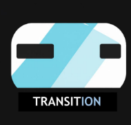
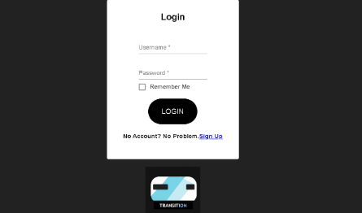
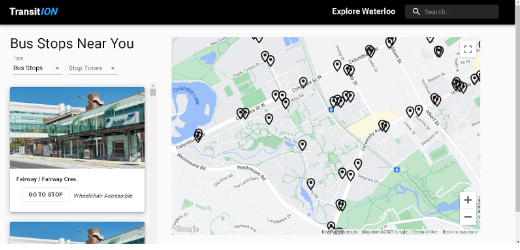

# TransitION

Transit Planning for the Waterloo GRT.

### How it works?

Uses GTFS data from the Waterloo GRT to allow people to plan their trips while taking the Waterloo GRT

### Tech Stack

- Html
- Css
- Javascript
- React
- Google Maps API
- Material-UI

### Looking Forwards

- Online database such as Firebase for login/logout. Or host server for the database.
- To save common routes a person travels and implement SMS messaging and GTFS-RT to notify people when their anticipated transport will be late/early.
